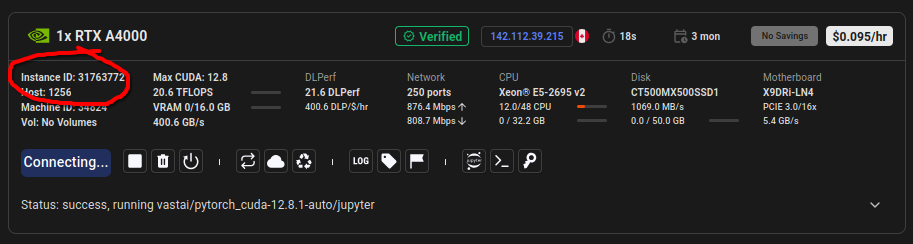

### ARENA

My study notes to https://github.com/callummcdougall/ARENA_3.0.git
(from February 2026)

I changed the structure to my taste.

#### My setup to run locally

1. `uv venv`
2. `uv pip install -r requirements.txt`

Then I use VS code to run the notebooks in `notebooks`

### Setup on vast.ai

1. connect via ssh
2. clone
3. Then just run `uv pip instrall -r requirements.txt` (using the preactivated environment `main` managed in conda)
4. install vscode extenisons

#### Semi-automatic Setup

##### Details

see `vastai_setup/README.md`

##### Quick refresher

Copy `Instance ID` into `vastai_setup/.env.vastai`

Then run `python vastai_setup/setup.py`

